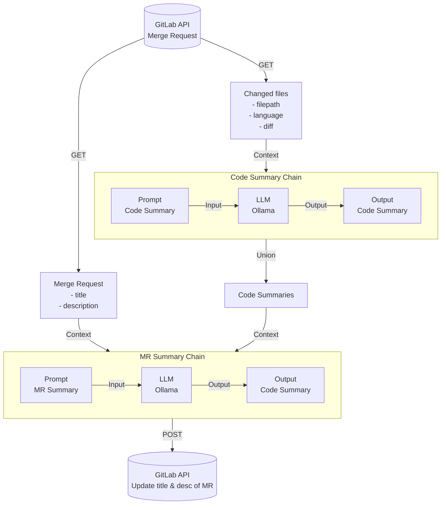
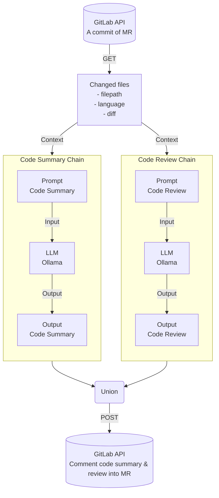

# Code Reviewer on GitLab CI

## 概要図

### MR Summary Chain


### Code Summary & Review Chain



## セットアップ

- Python 3.12.5 on Windows11

```powershell
# Pythonをインストール
winget install --id Python.Python.3.12 --version 3.12.5
python --version
python -m pip install --upgrade setuptools
python -m pip install --upgrade pip

# 仮想環境を作成
python -m venv .venv
./.venv/Scripts/activate
pip install .
pip install flake8 black isort python-dotenv unidiff PyGithub python-gitlab openai ollama langchain langchain-core langchain-community faiss-cpu

# 整形
python -m flake8 coderev examples test
python -m black  coderev examples test
python -m isort  coderev examples test

# 終了
deactivate
Remove-Item –path ./.venv –recurse
```

## TODO

- GitLab CIに、対応させたい
- GitHub Actionsに、対応させたい
- 作成したやつをpydanticに対応させたい
